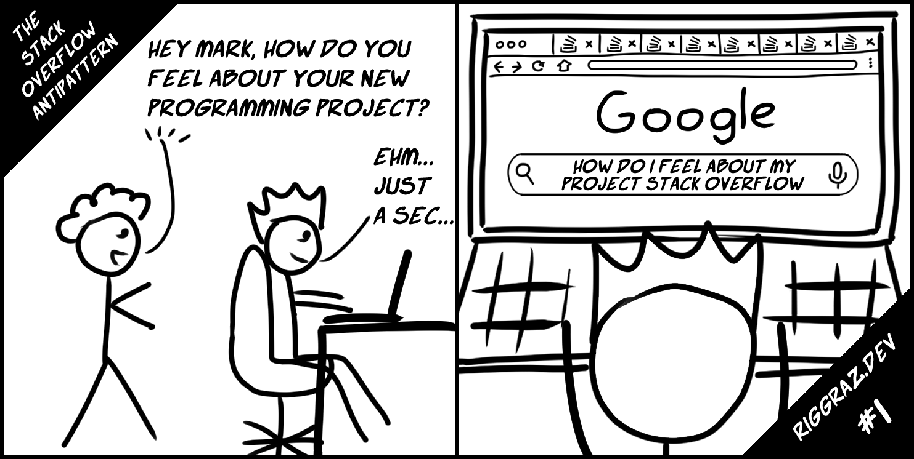

Sometimes programming can be frustrating. In the last few years I've noticed a recurrent pattern that drives me mad. I like to call it *Stack Overflow Antipattern*.

In this ~~informal blog post~~ rigorous medical paper I'll explain the symptoms, possible causes and treatment for this horrible ~~antipattern~~ disease.

---
{: data-content="symptoms"}

My definition of the Stack Overflow Antipattern is the following:

> Spending more time looking for a solution rather than thinking about it.

For me, it goes like this:

1. I encounter a problem I can't immediately solve
2. I google the problem
3. I find a seemingly-satisfying solution (usually on Stack Overflow)
4. I copy-paste the solution and test it out
5. If it works, I move on; otherwise, I go back to step 2.

During the whole process I'm completely focused on looking for a solution, I'm *rushing* towards the solution. As time goes on, if I can't find what I'm looking for, my frustration grows and I find myself skimming faster and faster through the results: I'm not thinking, I'm just looking for the damn solution.

---
{: data-content="a clinical case"}

---
{: data-content="causes"}

I think there are several causes that can lead to the Stack Overflow Antipattern.

The root cause is a lack of thinking. Obviously, not understanding the problem and the possible solutions results in a trial-and-error approach, which is exactly what the antipattern is about. But, at least personally, why don't I take the time to think?

Firstly, I know that the answer to my problem is probably somewhere on the web. We're all used to being spoon-fed by Stack Overflow. We're all used to having immediate access to tons of valuable information over the internet, so why not search there before overworking one's grey matter?

Another reason is that a programmer has to face lots of problems, sometimes not necessarily directly related to software development. Even though the problem at hand and its solution(s) should, ideally, be properly understood, there may be several reasons why one chooses not to do so, i.e. being in a hurry, pure and simple ineptitude, exhaustion, laziness etc.

Whatever the reason, we therefore decide, more or less consciously, not to think.

---
{: data-content="treatment"}

So, ultimately, the Stack Overflow Antipattern is all about a lack of reasoning. What then is the best (and free!) treatment for a compulsive refusal to think? Well, more thinking.

In particular, I believe there are three broadly-defined phases in which one should pause and ponder:

1. Before the search. The problem should be crystal clear in order to write the right query that will help find the solution. Bad search queries (or, even worse, queries about the *wrong* problem) rarely lead to satisfying answers.
2. During the search. The solution found should be at least clear enough to be sure it can solve the problem at hand (possibly without causing other problems!).
3. After the solution proved to work. This is the time to pause again and synthesize problem and solution together. Everything should be clear enough to remember it afterwards (or at least remember how to find the solution again), in order to solve the problem faster if it occurs again. This will save time in the long run.

The list above is by no means a strict rule, but a general guideline I came up with while writing the article. The heart of the matter is that one should think a lot before and after searching the web.

---
{: data-content="conclusions"}

Before closing up, I must emphasize two points.

First, I'm not saying that Stack Overflow or similar resources *shouldn't* be used. The point is that they shouldn't be used *mindlessly*.

Second, it's inevitable that sometimes, for a number of reasons, the Stack Overflow Antipattern will occur. Depending on the scenario, it could also be the best choice. For example, if a project is running late and timely delivery is essential, there could be no time to stop to think why a certain solution works. And that's okay. The important thing is to find a balance that takes into consideration both external factors (e.g. deadlines) and internal ones (e.g. one's desire to learn), and to consciously fall into the antipattern.

In the end, I think that the point of this article is pretty trivial. Everybody knows that thinking is an essential part of solving a problem, even if the answer is already available somewhere.

However, I also believe that many programmers are victims of the Stack Overflow Antipattern. At least I am, from time to time, but more than I'd like to.

---
{: data-content="discussion"}

Hey, thanks for reading all the way down here!

I'd be more than happy to hear your personal experience with the Stack Overflow Antipattern. You can reach me out through [email](mailto:riccardo.graziosi97@gmail.com) or any other means you like. Interesting discussions will be posted in this section!

Here you can find some comments about the post:

- [lobste.rs](https://lobste.rs/s/kftyrd/stack_overflow_antipattern)
- [r/coding](https://www.reddit.com/r/coding/comments/ixn3pk/the_stack_overflow_antipattern/)
- [r/programming](https://www.reddit.com/r/programming/comments/ixn3n9/the_stack_overflow_antipattern/)

Moreover, if you liked the article, consider subscribing to my [newsletter](https://tinyletter.com/riggraz) or [RSS feed](/feed.xml).

Trivia: I had the idea of this post nearly one year ago and is the number one reason that made me open this blog. It should've been the first article, but, just as I started writing it, I got the inspiration for the [code and memory post](https://riggraz.dev/code-and-memory.html). Since the latter was simpler and shorter, I decided to write it first.

I also want to mention that the comic strip was a last-minute idea. And, given my drawing skills, it was probably a bad idea.

---
{: data-content="updates"}

After reading this blog post, [Synchro](https://github.com/Synchro) found the inspiration to write an article about another antipattern that he usually sees on Stack Overflow and alike. Since he is the maintainer of [PHPMailer](https://github.com/PHPMailer/PHPMailer), he has to answer a lot of questions on SO or GitHub, so he knows what he's talking about. The article is called [The Stack Overflow Antipattern, part 2](https://marcus.bointon.com/the-stack-overflow-antipattern-part-2/).